# Family Star

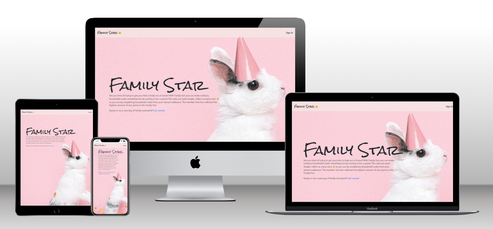

View the site [here](https://project5-task-app-front.herokuapp.com/)

## About
Family Star is a mix between a task board and a game that families can use to make ordinary household tasks to something fun. Parents can add tasks and family members to the family's shared task board. Depending on how challenging or how long time the task takes the parent can adapt how many star points(scores) completion of the task gives. The family member that currently has the highest amount of collected star points is the family star(leader). 

Family members can pick a task to complete by assigning themselves at the task. When the task is completed, the family member marks the task as done.  The tasks progress is followed by two scoreboards, one for the family member and one for the whole family.
In the family member scoreboard, the family member can follow their own progress as it will be updated with information about how many: star points and closed tasks the family member has. Instead of only containing information about one family member the family’s scoreboard contains information about the progress of the whole family. It contains information about: who is the family star, how many tasks there is to-do, completed tasks and ongoing tasks.

Currently the site contains these categories: Cleaning, Cooking, Homework and Garden.

## Target Audience
This website is meant to attract families that wants to find a way to motivate their children to help out at home or wants to make ordinary household tasks to something fun. 

Parents that use this site would like to organize household tasks that needs to be done. They want to be able to create tasks that they can share with the rest of the family.  

Children that use this site would like to choose a task to do and then mark it as done when completed. Both parents and children want to follow how the family progress with their tasks.  

The main reason for users to revisit the website is because the task managing is intuitive and it’s easy to get an overview of the scores. But also, that the page has a nice and playful design and will hopefully make their lives more organized. 

## Owner Goals
- This app should be like a mix of a task board and a game, a gamified task board.  
- To create an app that is easy to navigate  
- To create an app that doesn't contain any unnecessary buttons 
- To create an account and fill your task board with tasks should be quickly done without any unnecessary steps  
- The design should be playful with bright colors and happy icons.  

## Table of Contents
- [UX](#design)
    - [User stories](#user-stories)
- [Technologies used](#technologies-used)
    - [Languages](#languages)
    - [Frameworks and libraries](#frameworks-and-libraries)
    - [Other tools](#other-tools)
- [Access Overview](#access-overview)
- [React Library](#react-library)
    - [Structure and Code](#structure-and-code)
    - [UX](#ux)
- [Components](#components)
    - [Navbar](#navbar)
    - [Loader](#loader)
    - [Display Family Members](#display-family-members)
    - [Footer](#footer)
	- [Score Board Information Trigger](#score-board-information-trigger)
	- [Task Ellipsis Buttons ](#task-ellipsis-buttons)
- [Features](#features)
    - [Home page](#home-page)
    - [Task Board](#task-board)
    - [Profile Score Board](#profile-score-board)
    - [Family Member Score Board](#family-member-score-board)
    - [Task](#task)
    - [Assign button](#assign-button)
    - [Done Button](#done-button)
    - [Create Task](#create-task)
    - [Edit Task](#edit-task)
    - [Delete Task](#delete-task)
    - [Add Family member](#add-family-member)
	- [Search Task](#search-task)
	- [Filter Task](#filter-task)
- [Design](#design)
    - [Color Scheme](#color-scheme)
    - [Typography](#Typography)
	- [Icons](#icons)
	- [Wireframes](#wireframes)
- [Testing](#testing)
- [Future Improvements](#future-improvements)
    - [Code](#code)
    - [Known bugs](#known-bugs)
    - [Design decision based on test results](#design-decision-based-on-test-results)
- [Deployment](#deployment)
    -[Heroku deployment](#heroku-deployment)
- [Credits](#credits)
	- [Code](#code)
    - [Content and Media](#content-and-media)
	- [Test](#test)

## UX
### User Stories
[#11](https://github.com/MartinaB91/project5-task-app-front/issues/11) Epic: Registration, authentication and navigation
- [#7](https://github.com/MartinaB91/project5-task-app-front/issues/7) As a User I want to create a new account so that I can start/access a task-board for my family.
- [#8](https://github.com/MartinaB91/project5-task-app-front/issues/8) As a User I want to sign in with my username so that I can manage my task-board.

[#37](https://github.com/MartinaB91/project5-task-app-front/issues/37) Epic: Ability to CRUD family members

- [#38](https://github.com/MartinaB91/project5-task-app-front/issues/38) As a Parent I want to create a new family member so that I can add all my family members to the task-board.
- [#40](https://github.com/MartinaB91/project5-task-app-front/issues/40) As a Parent I want to delete a family member so that I can remove a member that don’t want to participate.

[#33](https://github.com/MartinaB91/project5-task-app-front/issues/33) Epic: Ability to CRUD tasks 
- [#34](https://github.com/MartinaB91/project5-task-app-front/issues/34) As a Parent I want to create a task so that I can fill our task-board with task.
- [#35](https://github.com/MartinaB91/project5-task-app-front/issues/35) As a Parent I want to update our tasks so that I can make corrections if needed.
- [#36](https://github.com/MartinaB91/project5-task-app-front/issues/36) As a Parent I want to delete tasks so that I can ensure that our task board only contains the content we parents selected.

[#28](https://github.com/MartinaB91/project5-task-app-front/issues/28) Epic: Task details
- [#29](https://github.com/MartinaB91/project5-task-app-front/issues/29) As a Family member I want to see which due date the task has so that I can know when it needs to be done.
- [#30](https://github.com/MartinaB91/project5-task-app-front/issues/30) As a Family member I want to see how many points the task will give so that I can choose a task based on the points it will give.
- [#31](https://github.com/MartinaB91/project5-task-app-front/issues/31) As a Family member I want to see which tasks that has been assigned and by who so that I can follow what other family members do.
- [#32](https://github.com/MartinaB91/project5-task-app-front/issues/32) As a User I want to see which category a task belongs to so that I can sort out tasks that’s not in the category I am searching for.

[#24](https://github.com/MartinaB91/project5-task-app-front/issues/24) Epic: Create family scoreboard
- [#25](https://github.com/MartinaB91/project5-task-app-front/issues/25) As a Family member I want to see how many open tasks there are so that I can know how much there is to do.
- [#26](https://github.com/MartinaB91/project5-task-app-front/issues/26) As a Family member I want to see how many tasks our family has completed so that I can follow how much work We have done together.
- [#27](https://github.com/MartinaB91/project5-task-app-front/issues/27) As a Family member I want to see who in the family that has the highest score so that I can know how many points I need to collect to be the leader.
- [#62](https://github.com/MartinaB91/project5-task-app-front/issues/62) As a Family member I want to see how many ongoing tasks Our family has so that I can know we are doing.

[#16](https://github.com/MartinaB91/project5-task-app-front/issues/16) Epic: Create current family member scoreboard
- [#17](https://github.com/MartinaB91/project5-task-app-front/issues/17) As a Family member I want to see my profile icon when I have selected my profile so that I can confirm that I am using the correct profile (family member).
- [#21](https://github.com/MartinaB91/project5-task-app-front/issues/21) As a Family member I want to see how many tasks I have completed so that I can follow how much work I have done.
- [#22](https://github.com/MartinaB91/project5-task-app-front/issues/22) As a Family member I want to see how many points I have earned so that I can compare my points with other family members.
- [#23](https://github.com/MartinaB91/project5-task-app-front/issues/23) As a Family member I want to see how many ongoing tasks I have so that I can decide if I can take on some more tasks or not.

[#15](https://github.com/MartinaB91/project5-task-app-front/issues/15) Epic: Search, filter, and sort tasks 
- [#12](https://github.com/MartinaB91/project5-task-app-front/issues/12) As a Family member I want to search for specific tasks so that I can find the task I want to find easier.
- [#13](https://github.com/MartinaB91/project5-task-app-front/issues/13) As a Family member I want to filter tasks so that I can view tasks that has a specific status.
- [#14](https://github.com/MartinaB91/project5-task-app-front/issues/14) As a Family member I want to view tasks sorted on due date so that I can see the tasks with the closest due-date first and prioritize my task selection.

[#48](https://github.com/MartinaB91/project5-task-app-front/issues/48) Epic: General UI/UX behaviours
- [#49](https://github.com/MartinaB91/project5-task-app-front/issues/49) As a User I want to get feedback for every action I initiate so that I can know that my action is processed.

## Technologies Used
### Languages
- [HTML5](https://developer.mozilla.org/en-US/docs/Glossary/HTML5)
- [JavaScript](https://www.javascript.com/)
- [CSS](https://developer.mozilla.org/en-US/docs/Web/css)
- [JSX](https://reactjs.org/docs/introducing-jsx.html)
### Frameworks and Libraries
- [React Bootstrap (2.5.0)](https://react-bootstrap.github.io/)
- [React Router (6.3.0)](https://reactrouter.com/en/main)
- [Font Awesome](https://fontawesome.com/) - Used for adding icons to website
- [Google Fonts](https://fonts.google.com/) - Used for fonts
### Other tools
- [Chrome DevTools](https://developer.chrome.com/docs/devtools/) - Used for debugging
- [Compress JPEG](https://compressjpeg.com/) - Used for compress images
- [Convertio](https://convertio.co/download/8f4ef43897af54f80228a73c98cc326cc42215/compress) - Used convert images from jpg to webp
- [Favicon](https://favicon.io/favicon-converter/) - Used for convert img to favicon
- [GitHub Issues](https://github.com/features/issues) - Used for project planning 
- [Heroku](https://id.heroku.com/login) - Used to deploy app
- [HTML Color Codes](https://html-color-codes.info/colors-from-image/) - Used for finding colors from images
- [Invisionapp](https://www.invisionapp.com/home) - Used for wireframes
- [Techsini](https://techsini.com/multi-mockup/index.php) - Used for creating multi responsive mockup image

## Access Overview
- There are three different roles with different access: parents, children and admin. The administrator has access to admin page but can also be a parent and because of this access all sites and functions.  The parent role is available for the admin just for testing and evaluation purposes. 

|Page/functionality     | Parent | Child|  
|------------------|---------|--------| 
|Home              | Yes     | Yes    | 
|Task board	      | Yes	 | Yes    | 
|Create Task       | Yes     | No    | 
|Edit Task         | Yes      | No   | 
|Delete Task       | Yes     | No    | 
|Create Family Member       | Yes      | Yes    | 
|Assign Task       | Yes      | Yes    | 
|Done Task          | Yes      | Yes    | 
|Search Task    | Yes     | Yes    | 
|Filter Task	|Yes|Yes| 

## React Library 
### Structure and Code
- With the use of react components it will be possible to reuse some of the code in the project. There is not so much reuse in this specifik project yet, however thanks to the use of components it will be possible to replace for example "DisplayFamilyMembers" with a new version without effecting other code to much. 
- Another benefit of using the react library is that the code files are smaller and if the project would be continued it will be easier for another devloper when this structure has been used. 
- Usage of react JSX has been of great use when creating dynamic html with variables and passing parameters. 
### UX
The user experience has been improved by using react. 
- One feature that has improved the user experience is the hooks which have made it possible to run certain code on specific events for example keeping the current family member scoreboard updated without refreshing the page. 
- Another feature that has improved the user experience is the react spinner which made it possible to easy show the user that the content, in this project tasks are loading. 
- By using react bootstrap the user interface is clearly structured and fully responsive, this is something that most users expect since every day usage could be by phone, tablet and computer. 

## Components
### Navbar 
- As a non-authenticated user, the navbar contains “Family Star” with link to home page and “Sign In”.  

- As an authenticated user, the navbar contains “Family Star” as above. It also contains “Task Board” and the current profile’s “Username” which is a dropdown menu. 

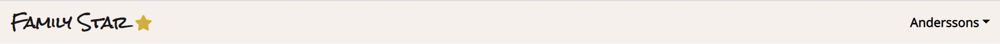

- When the dropdown is expanded it contains the component display family members which will be explained in detail later together with a link to “Add Family Member”, “Add task” and a “Sign Out” button. 

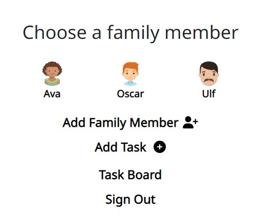

### Loader
- When tasks are loading a spinner icon and a text "Loading" is shown.

### Display Family Members 
- In this component all the profile’s family members are displayed as an image and family member name.  

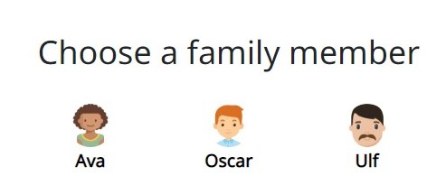

- If the profile doesn’t have any family members yet, the text “You haven’t added any family members yet. Create one below” will be displayed.  

### Footer 
- The footer contains links to “Home” page and “Task board” 

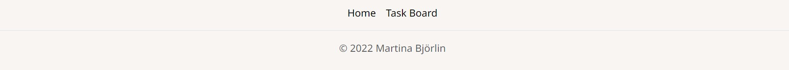

### Score Board Information Trigger  
- When hovering the i-icon in the profile scoreboard the user will find information about what the user can: do in the navbar, find on the scoreboard and how you assign and complete a task on the task board.  This can be useful information the first time you use the app and disturbing the regular user

### Task Ellipsis Buttons 
- The ellipsis button is displayed on all tasks and when the user clicks the button it will expand and the user will be displayed with two links displayed as icons. One for edit tasks and one for delete task.  

## Features
### Home page 
- The home page contains a hero image with some text. The text consists of an explanation of what you can use this website for. This is meant to attract users to want to try this app. The text is followed by a sign-up link to make it easy for visitors to sign up. 

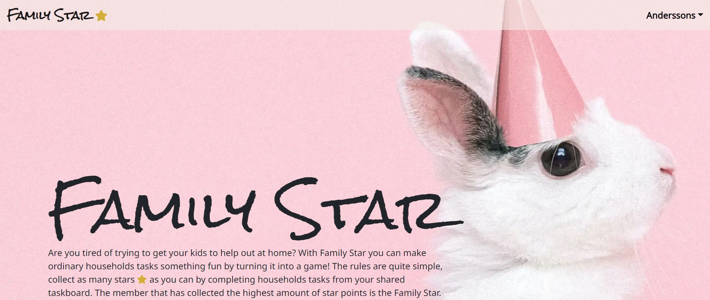

### Task Board 

- This page is the main page where you can reach all other pages and the page divided into four sections. The first section is the profile scoreboard, followed by the family member score board. Then the user can find a section for searching and filtering and below the task section where all tasks are displayed 

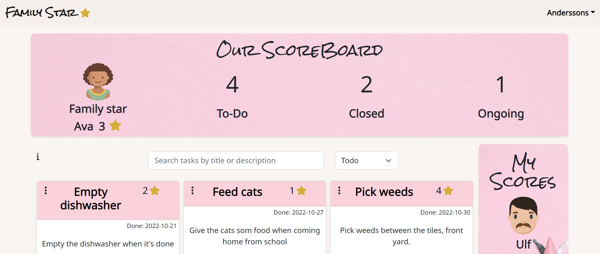

### Profile Score Board 
- The profile scoreboard contains information that applies to all family members.  
- Family Star shows a profile image, nickname and points of the member with the highest number of stars. 
- Todo, is all tasks that needs to be done but isn’t assigned yet 
- Completed tasks, is all tasks that the family has marked as done 
- Ongoing tasks, is all tasks that at the moment is assigned to a family member 

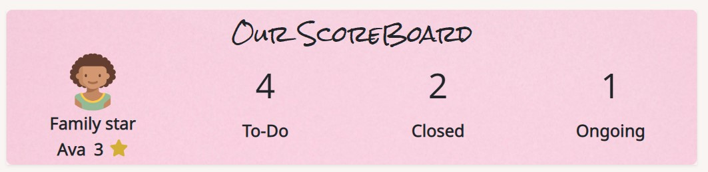

### Family Member Score Board 
- The family member scoreboard contains information that applies to a specific family member. By being able to see their own scores together with the scores on the profile scoreboard, the user can compare their own performance and choose tasks according on how many points needed to become the Family Star.  
- On the top of the scoreboard the family member image and name are displayed. This will let the user know who the current family member is.  
- Star points, how many points the member has collected.  
- Closed tasks, shows how many tasks the member has marked as done.  

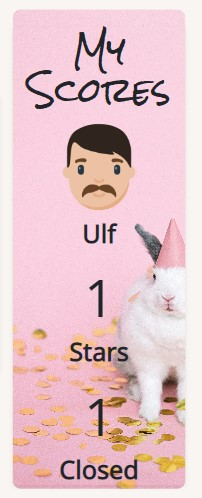

- If the user has not selected a family member family member score board will show a text "You haven't chosen a family member yet. Please Select one in the navbar"

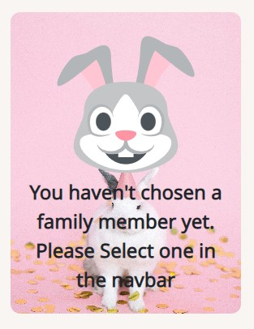

### Task 
- Every task contains, ellipsis button, title, star points, end date, task description, assign-button, category and done-button.  
- All tasks are by default ordered by end date, tasks that has the closest end date is displayed first. This to make it easy for the users to see which tasks that needs to be done next.  

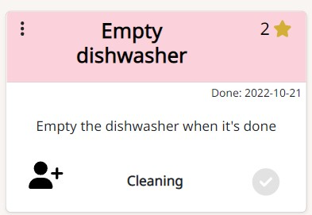

### Assign Button 
- If a task is unassigned the assign-button will be displayed as user-plus icon, when the task is assigned the family members profile image and name is displayed.  
- A user can’t mark a task as done before the task is assigned and only the user that has assigned a task can unassign the task.  

### Done Button 
- A task that isn’t marked as done will have a grey button, when the task is done and the user clicks the button it will change color to green. 

### Create Task 
- This page contains a form for creating a task. The Parent can add a: title, category, star points, end date, description and optionally assign a family member. 
- When the task is created the user will be redirected to the task board.  
- If a family member that has the role “child” is trying to create a task the user will see a warning message: “Ask your parents to create a task”. 

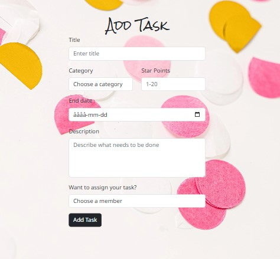

### Edit Task 
- At this page the Parent can update almost all parts of the task, the one thing they can’t update is the tasks status (to-do or done).  
- When the task is updated, the user will be redirected to the task board.  
- If a family member that has the role “child” is trying to edit a task the user will see a warning message: “Ask your parents to edit the task”. 
- If a task already is assigned it is not possible to edit and the user will see a warning message: "You can't edit an assigned task".

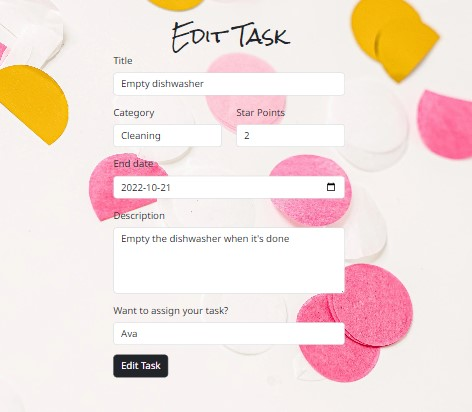

### Delete Task 
- When the user clicks on the trash can icon displayed in the ellipsis button, they will be redirected to a delete task page and asked to confirm deletion. When the task is deleted, the user will be redirected to the task board.  
- If a task already is assigned it is not possible to delete and the user will see a warning message: "You can't delete an assigned task".

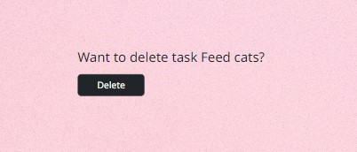

### Add Family member  
- This page contains a form for creating a family member. The family members can add a: profile image, nickname and a role.  
- When the family member is created the user will be redirected to the task board. 

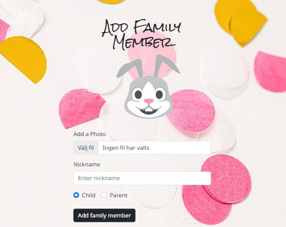

### Search Task 
-  When the user enter text in the search field all tasks were the title or description matches the entered text will be shown.

### Filter Task  
- The tasks can be filtered in five different ways. Per default the tasks are filtered by “Todo” which means that only tasks that isn’t assigned or marked as done is shown. They are ordered by end date where the oldest tasks are displayed first. 
- In the second filter “My task” the user can find all tasks they have assigned but not task they have completed. 
- “Assigned” tasks is all tasks that is assigned but not completed. 
- “Done” tasks are all tasks that are completed. They are sorted by end date but unlike filters above the task that has the newest end date is displayed first. 
- “All” tasks, here you can find all tasks, tasks that needs to be done, ongoing tasks(assigned) and completed tasks. Like “Done” the newest tasks are on the top.  
- If the filter category is empty following text will be displayed "Oops there is nothing there"

## Design
### Color Scheme
- The colors on this site was choosen because they go well togehter with the sites images.
-  Task headers (#FBD1DB), Taskboard (#F9F5F2), Star icon (#D4AF37), Buttons and text (black), Done button default (lightgrey), Done button clicked (green). 

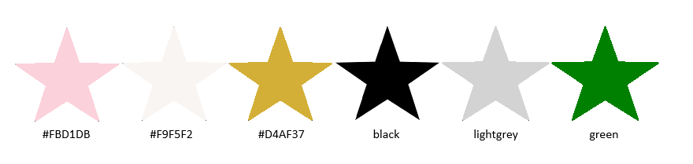

### Typography
- The font used for h1 and h2 headers is Rock Salt with fallback cursive. 

- The font used for all other text is Noto Sans with fallback sans-serif. 

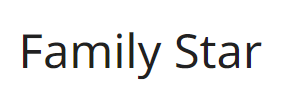

### Icons 
- Star, used in headers: 
- Ellipsis button: 
- Edit task button: 
- Delete task button: 
- Assign task button: 
- Arrow pointing at "Add task": 
- No choosen family member or default image for family member: 
- No tasks found 

### Wireframes 
- [**Phone**](documentation/wireframes/WIREFRAMES.md)
- [**Desktop**](documentation/wireframes/WIREFRAMES.md)
## Testing
Read more about test and validation [here](/testing/TEST.md)
## Future Improvements
The following user stories was started (code for back-end is done) but not finished. This beacuse other tasks had higher prioritization and the time for this project was running out. In the future this could be added to the front-end:

- [#39](https://github.com/MartinaB91/project5-task-app-front/issues/39): Update family member
- [#40](https://github.com/MartinaB91/project5-task-app-front/issues/40): Delete family member

### Code
- More automatic backend tests before building code could have been done (TDD). 
- Assign and Done button could haven been separate from task and made as components.
### Known bugs
Because of limited time these bugs was not prioritezed since testing and validation needed to be done properly. These bugs are not critical and have little impact on the user experience: 

- [#55](https://github.com/MartinaB91/project5-task-app-front/issues/55) - More than one Family Stars(Leaders)
- [#56](https://github.com/MartinaB91/project5-task-app-front/issues/56) - No warning when leaving input empty. Edit task form 
- [#99](https://github.com/MartinaB91/project5-task-app-front/issues/99) - Alert pushes form outside element
- [#101](https://github.com/MartinaB91/project5-task-app-front/issues/101) - Forms not centered 576px

### Design decision based on test results
- In the final tests a bug that was thought to be fixed earlier in the process was found again. Ongoing tasks count in My Scoreboard was possible to get unwanted behaviour from if not using the most common operations. For example if a user claims a task, set it to done, undo it and then set it to done again and then change family member. When doing this the scores could be off by one. 

Because it's late in the project and that users that have tested/seen the application has had a hard time figuring out why the values on ongoing tasks is not the same in the both scoreboards presented it was an easy decision to remove this feature. 

## Deployment
### Local deployment
1. Log into your GitHub account and locate this project.
2. Create your local workspace and clone the project to your folder by using CLI command “git clone https://github.com/MartinaB91/project5-task-app-front.git”.
3. Start app by CLI command "npm start".

### Heroku deployment
This project is deployed to Heroku. Below the steps taken to deploy is described.

1. Create an Heroku account or sign into your account.
2. Create a new app by choosing option “Create new app”, located at the centre of dashboard (or if you’re not a new user it’s found when expanding “New” in the top right corner).
3. Give your app a name, choose a region and click “Create”.
4. On the "Deploy"-tab select deployment method "GitHub"
5. Enter the project name: project5-task-app-front and click on the button "Connect"
6. Scroll down to manual deploy and click on button "Deploy Branch" to deploy the latest version. 

## Credits
### Code
- [Mozilla](https://developer.mozilla.org/en-US/docs/Web/API/Storage/) and [Bits and Pieces](https://blog.bitsrc.io/5-methods-to-persisting-state-between-page-reloads-in-react-8fc9abd3fa2f) - Used as inspiration when building CurrentFamilyMemberProvider
- [Stackoverflow - Highest value](https://stackoverflow.com/questions/36941115/return-object-with-highest-value) - Used for finding and returning family member with highest star points. 
- [Pluralsight](https://www.pluralsight.com/guides/how-to-get-selected-value-from-a-mapped-select-input-in-react) - Used as inspiration for mapping out categories in create and edit task form.
### Content and Media
- [Pexels](https://www.pexels.com/sv-se/) - All pictures on app are from Pexels
- [SVG Repo](https://www.svgrepo.com/) - Used for default and 404 page icons
### Test and validation
- [W3C](https://validator.w3.org/) - Used for validate css
- [JSHint](https://jshint.com/) - Used for validate JS

