# Test and validations

## Table of contents
- [Introduction ](#introduction)
- [Test](#test)
    - [Test cases](#test-cases)
    - [Responsiveness tests](#responsiveness-tests)
    - [Exploratory tests](#exploratory-tests)
    - [Usability testing](#usability-testing)
    - [Automatic tests](#automatic-tests)
- [Lighthouse reports](#lighthouse-reports)
- [Solved bugs during development](#solved-bugs-during-development)
- [Validation](#validation)

## Introduction 
During the development process, unit testing has been done to check if functionality is as expected. Same test has been executed again later on when new features has been added.

## Test 

### Test cases
|Tests for Epic [#11](https://github.com/MartinaB91/project5-task-app-front/issues/11) Registration, authentication and navigation||
| ----------- | ----------- |
|**Test name** |**Test id:** |
|Test: Sign up User |[#68](https://github.com/MartinaB91/project5-task-app-front/issues/68) | 
|Test: Sign in with username User | [#69](https://github.com/MartinaB91/project5-task-app-front/issues/69)|
|Test: No chosen family member when sign in| [#70](https://github.com/MartinaB91/project5-task-app-front/issues/70)|

|Tests for Epic [#37](https://github.com/MartinaB91/project5-task-app-front/issues/37) Ability to CRUD family members||
| ----------- | ----------- |
|**Test name** |**Test id:** |
|Test: Add family member User|[#71](https://github.com/MartinaB91/project5-task-app-front/issues/71) |
|Test: Warnings message add family member|[#72](https://github.com/MartinaB91/project5-task-app-front/issues/72) | 

|Tests for Epic [#33](https://github.com/MartinaB91/project5-task-app-front/issues/33) Epic: Ability to CRUD tasks||
| ----------- | ----------- |
|**Test name** |**Test id:** |
|Test: Add task Parent |[#73](https://github.com/MartinaB91/project5-task-app-front/issues/73) | 
|Test: Warnings message add task|[#74](https://github.com/MartinaB91/project5-task-app-front/issues/74) |
|Test: Update task Parent |[#75](https://github.com/MartinaB91/project5-task-app-front/issues/75) |
|Test: Delete task Parent|[#76](https://github.com/MartinaB91/project5-task-app-front/issues/76)|

|Tests for Epic [#28](https://github.com/MartinaB91/project5-task-app-front/issues/28) Task details||
| ----------- | ----------- |
|**Test name** |**Test id:** |
|Test: View due-date|[#77](https://github.com/MartinaB91/project5-task-app-front/issues/77) | 
|Test: View star points|[#78](https://github.com/MartinaB91/project5-task-app-front/issues/78)|
|View Assignment, assigned|[#79](https://github.com/MartinaB91/project5-task-app-front/issues/79) |
|Test: View Assignment, not assigned |[#80](https://github.com/MartinaB91/project5-task-app-front/issues/80)|
|Test: View Category|[#81](https://github.com/MartinaB91/project5-task-app-front/issues/81)|

|Tests for Epic [#24](https://github.com/MartinaB91/project5-task-app-front/issues/24) Create family scoreboard||
| ----------- | ----------- |
|**Test name** |**Test id:** |
|Test: View open tasks, family scoreboard|[#82](Create family scoreboard) | 
|Test: View Number of completed tasks Family, family scoreboard|[#83](https://github.com/MartinaB91/project5-task-app-front/issues/83) |
|Test: View ongoing tasks, family scoreboard| [#84](https://github.com/MartinaB91/project5-task-app-front/issues/84)|
|Test: View family leader(star), family scoreboard|[#85](https://github.com/MartinaB91/project5-task-app-front/issues/85)|

|Tests for Epic [#16](https://github.com/MartinaB91/project5-task-app-front/issues/16) Create current family member scoreboard||
| ----------- | ----------- |
|**Test name** |**Test id:** |
|Test: Display profile image, my scoreboard|[#86](https://github.com/MartinaB91/project5-task-app-front/issues/86) | 
|Test: view ongoing tasks, my scoreboard |[#87](https://github.com/MartinaB91/project5-task-app-front/issues/87) |
|Test: view star points, my scoreboard|[#88](https://github.com/MartinaB91/project5-task-app-front/issues/88) |
|Test: View Number of completed tasks, my scoreboard|[#89](https://github.com/MartinaB91/project5-task-app-front/issues/89)|

|Tests for Epic [#15](https://github.com/MartinaB91/project5-task-app-front/issues/15) Search, filter, and sort tasks||
| ----------- | ----------- |
|**Test name** |**Test id:** |
|Test: Search task by title|[#90](https://github.com/MartinaB91/project5-task-app-front/issues/90) | 
|Test: Search task by description|[#91](https://github.com/MartinaB91/project5-task-app-front/issues/91) |
|Test: Filtering tasks, Todo| [#92](https://github.com/MartinaB91/project5-task-app-front/issues/92)|
|Test: Filtering tasks, My tasks|[#93](https://github.com/MartinaB91/project5-task-app-front/issues/93)|
|Test: Filter tasks, Done|[94](https://github.com/MartinaB91/project5-task-app-front/issues/94)|
|Test: Filter tasks, Assigned |[#95](https://github.com/MartinaB91/project5-task-app-front/issues/95)|
|Test: Filter tasks, All|[#96](https://github.com/MartinaB91/project5-task-app-front/issues/96)|
|Test: Sort task, Todo|[#97](https://github.com/MartinaB91/project5-task-app-front/issues/97)|

Test results [here](/testing/TEST_RECORDS.md)

### Responsiveness tests

- [#45]https://github.com/MartinaB91/project5-task-app-front/issues/45

Test results [here](/testing/TEST_RECORDS.md)

### Exploratory tests 

- [#57](https://github.com/MartinaB91/project5-task-app-front/issues/57)
- [#59](https://github.com/MartinaB91/project5-task-app-front/issues/59)
- [#66](https://github.com/MartinaB91/project5-task-app-front/issues/66)

Test results [here](/testing/TEST_RECORDS.md)

### Usability testing

No formal has been conducted but informal test were the user has freely used the app and given feedback has been made. 

### Automatic tests

No automatic front end tests has been done. 

## Lighthouse reports  

Overall the scores are very good. But as expected the taskboard has a lower performance score. There is probably some optimizations that could be done regarding API calls to back-end and states that is updated when not needed. 

### Sign Up

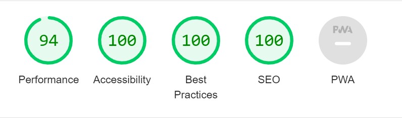

### Sign In

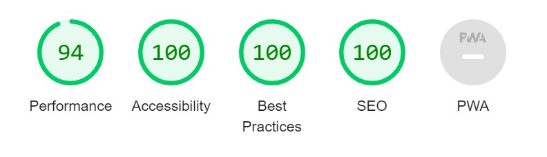

### Home 

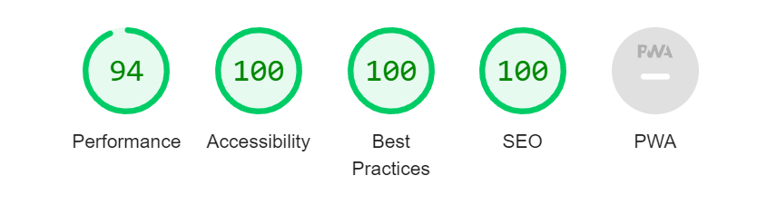

### Task Board

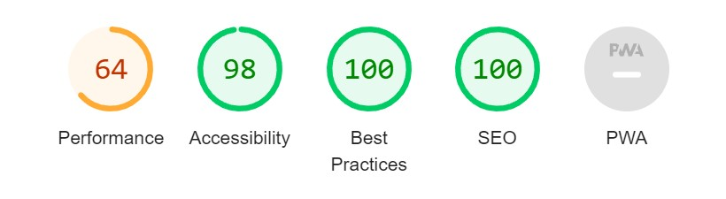

### Add Family Member

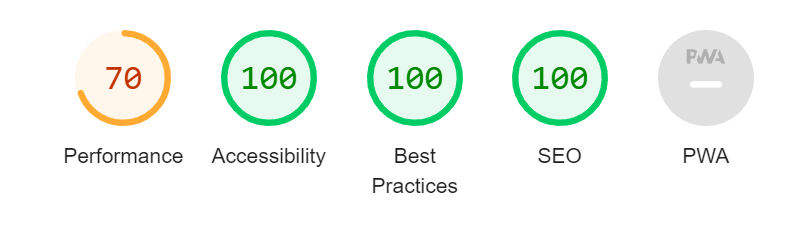

### Add Task

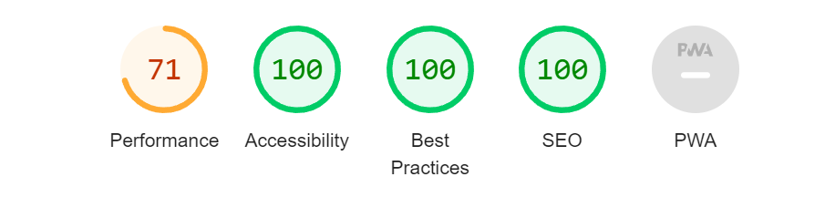

### Edit Task

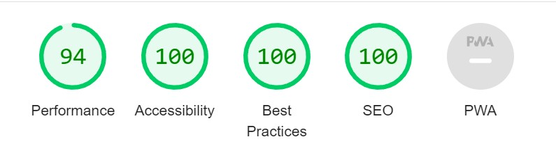

### Delete Task

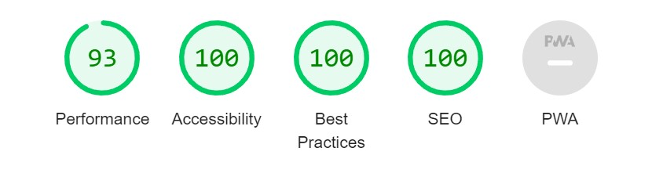

## Solved bugs during development
- [#65](https://github.com/MartinaB91/project5-task-app-front/issues/65) Can't add family member, first time user
- [#98](https://github.com/MartinaB91/project5-task-app-front/issues/98) Spinner keeps loading, My tasks

## Validation

### CSS

All CSS has been validated using [W3C](https://validator.w3.org/) without errors or warning.

### JavaScript

npm build warnings:

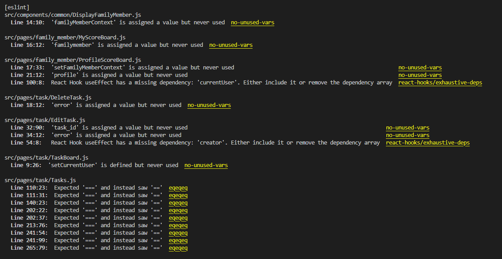

"is assigned a value but never used":
One reason for some of these warnings is that a imported context state is used but the set state is not used or only the set state is used. 

The other reason is that error handling is only partially implemented. Therefore it is left as is since it will be easier to implement it fully in a new version.

"React Hook useEffect has missing dependency":

This is known and has the intentional functionality. For example we don't wan't the useEffect to trigger every time currentUser changes only check if we have a current user.

"Expected '===" and instead saw '==':

This warning could have been fixed by setting the values at all times to the same type. However this is not done. For example some times a number can be a string and other times an integer. Changing this should be quite simple, unfortunately this was discovered late in the project and other more important matters has been prioritized. 

All JavaScript code has also been validated using [JSHint](https://jshint.com/). The following warnings were found:

ProfileScoreBoard.js:

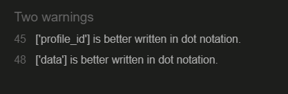

- Tasks.js:

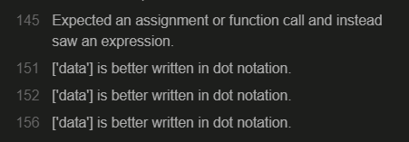

These warnings are ignored since the functionality is as expected and changing this late on in the project could possibly have some side effects. 

